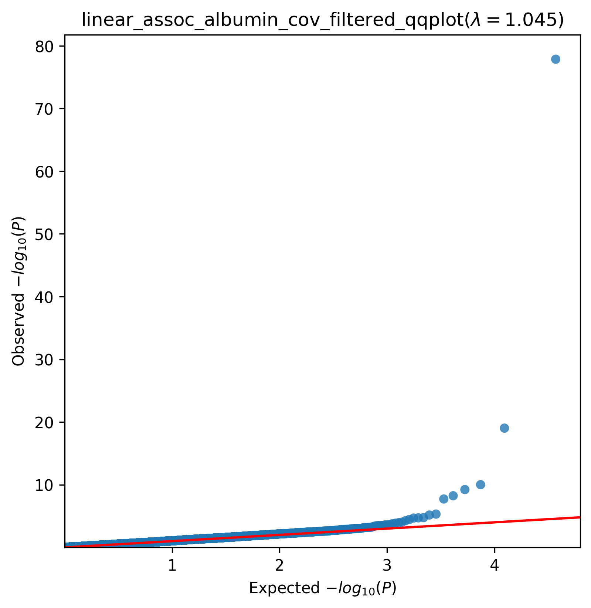
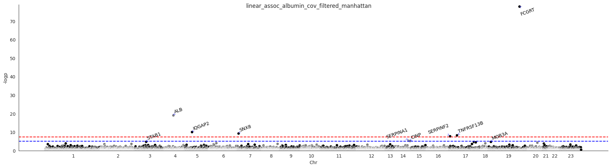

.. _albumin:

`Back to overview <https://genrisk.readthedocs.io/en/latest/real_cases.html#other-phenotypes>`_

Albumin Association Analysis
==============================================
Download :download:`full summary statistics <../../association_results/linear_assoc_albumin_cov_filtered.csv>`

.. csv-table:: Albumin associations
   :delim: ;
   :header-rows: 1

   genes;p_value;beta_coef;std_err;fdr_bh_adj_pval
   FCGRT;1,39E-62;-0.00881297849815458;0.00046927219718959214;2,57E-59
   ALB;9,45E-05;-0.007165039942758869;0.0007876688039567413;8,77E-01
   IQGAP2;9,89E+03;-0.0018679429450545056;0.0002887490167931902;6,12E+08
   SNX8;5,96E+04;-0.002130402975710763;0.0003440664840022732;2,77E+09
   TNFRSF13B;5,81E+07;0.0021328427136738342;0.0003663184168277329;2,16E+11
   SERPINF2;1,90E+08;0.006255536294495246;0.0011127831697945929;5,87E+10
   SERPINA1;4,83E+09;0.0017737890147610904;0.00038795091116244673;0.012805284458648236
   CINP;6,80E+09;-0.005447681600871162;0.0012105873469096752;0.015772694914048632
   STAB1;1,78E+11;0.0008860544961343359;0.00020649818834355888;0.03525973201665674
   MOB3A;1,93E+11;-0.0020993931193025277;0.0004913578696186222;0.03525973201665674
   BRIP1;2,09E+11;-0.0012578013934866016;0.000295592770502105;0.03525973201665674
   ABCA6;3,47E+11;-0.001651748481451401;0.0003989575730345079;0.05370027401556485
   HNF4A;5,52E+11;-0.0026615919944261847;0.0006600477369111137;0.07884180897003057
   FLOT1;9,39E+10;-0.0027071955099131004;0.0006931090488193352;0.12450030819747178
   PIK3C3;0.00011583405588167004;0.001979109848861628;0.0005134019439578823;0.14329444939601796
   OMA1;0.00013693233301648777;0.0020470572681532944;0.0005367563113008408;0.15880727321587168
   USP16;0.00016573290726501364;0.0021381335738149577;0.000567696194711987;0.18090234277703487
   ZFAT;0.00023283581346172143;-0.0012692877630649372;0.0003448649535034266;0.2312243174808551
   COL4A4;0.00023675695366114717;-0.001601885948697374;0.0004357361720933396;0.2312243174808551
   WFIKKN2;0.00026354896576401277;0.0019102155846812934;0.0005235161634163423;0.244520730435851
   CD36;0.0003233898950590291;0.0017788178631599823;0.0004946796431443163;0.2693540201901737
   PRR30;0.0003242404964563054;-0.0015548463368680852;0.00043247661665552997;0.2693540201901737
   ICMT;0.0003338619564762877;0.004739787253190162;0.001321160305337605;0.2693540201901737
   BTN3A3;0.00036290068228258366;-0.001554461009169444;0.0004359384447416518;0.2805827108514843
   FNDC3A;0.0004246916895736616;-0.002152724766942991;0.0006108176115844382;0.3152231596691546
   PABPC1L2A;0.0005486692485267135;0.04948464208207453;0.01431896947192682;0.3915810221408345
   COL17A1;0.0006394703309641698;-0.0010188999858761994;0.0002984146235062976;0.41684289799542196
   AQP2;0.0006453123157808667;-0.0026197915182646957;0.0007678398455499154;0.41684289799542196
   MET;0.0006688124881816373;-0.0014110589032405945;0.0004147569270264333;0.41684289799542196
   DPF1;0.0006739214776817557;-0.0031928710609645176;0.0009390647421892945;0.41684289799542196

The QQ-plot:
------------

The Manhattan plot:
--------------------

