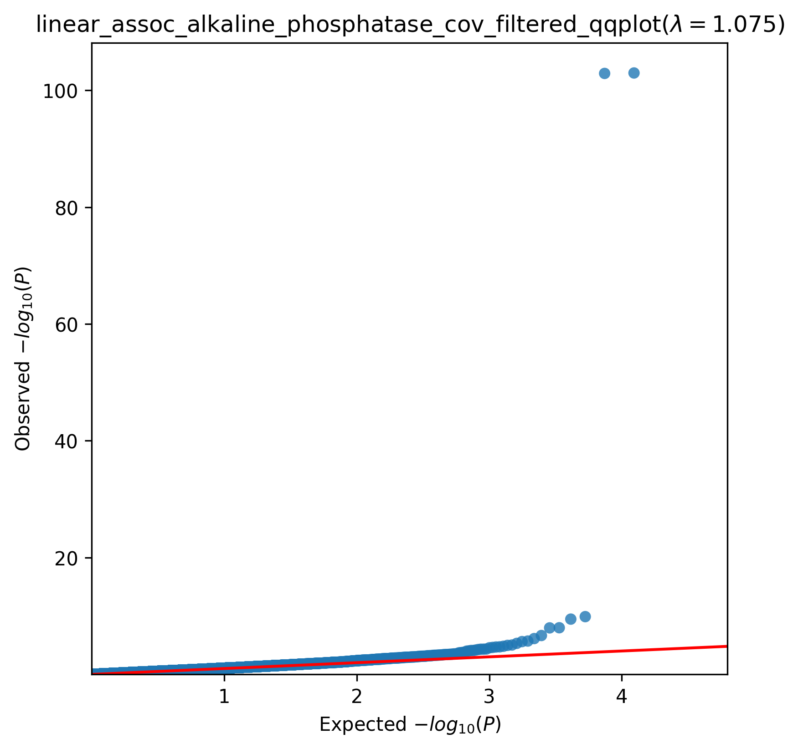
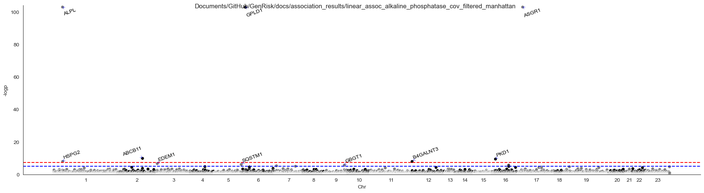

.. _albumin:

Albumin Association Analysis
==============================================
Download :download:`full summary statistics <../../association_results/linear_assoc_alkaline_phosphatase_cov_filtered.csv>`

.. csv-table:: Albumin associations
   :delim: ;
   :header-rows: 1

   genes;p_value;beta_coef;std_err;fdr_bh_adj_pval
   ALPL;1,06E-87;-0.21036533969007754;0.0042379513843159135;7,83E-85
   ASGR1;1,06E-87;0.17328495368476576;0.008006979094325978;7,83E-85
   GPLD1;1,27E-87;-0.06648232081651664;0.0030731113069502043;7,83E-85
   ABCB11;1,30E+06;0.024428432222687254;0.003800635815244567;6,04E+06
   PKD1;3,48E+04;-0.01012897905008065;0.0016138534694894377;1,29E+10
   HSPG2;1,04E+08;-0.007227590680398362;0.0012626442967385689;2,92E+10
   B4GALNT3;1,10E+07;0.017219512345058564;0.0030132019379836904;2,92E+10
   EDEM1;2,24E+09;0.027640083239447163;0.005337383454588049;0.000519276903330388
   SQSTM1;7,44E+08;0.019455968694462086;0.003930718163108141;0.0015340001282074418
   GBGT1;1,97E+10;-0.015725825441384695;0.0033062446112086708;0.0036604175887185344
   CCL17;2,44E+10;0.08163684700406743;0.01732213559607908;0.004124262452984468
   ACTB;4,92E+09;0.33183884996693325;0.07263600184711903;0.007601597211068879
   ZNF800;9,42E+09;-0.048958576883633524;0.011051291847906299;0.013452841414574115
   DOK4;1,09E+11;0.03355340162194955;0.007628276774235884;0.01445390915762548
   ADH1B;1,54E+11;-0.015107659947890857;0.003494260616572134;0.019005104912868956
   VBP1;1,93E+09;0.1930300949631988;0.04517927111591119;0.022427750461082818
   MLLT1;2,06E+11;0.03194908652008923;0.007502772435012159;0.022497806621698188
   ZNRD1;2,43E+10;0.032770370714193614;0.007762732658533884;0.025033053496524797
   LRRC37A;2,80E+10;0.1920735998414563;0.04585189526080557;0.027379968325987294
   RNF181;4,54E+11;0.03570450982561114;0.008754824606954962;0.0414882737821049
   OSGIN1;4,85E+10;-0.010569407588883814;0.0026015805924395163;0.0414882737821049
   NR1H4;4,92E+10;-0.02040979702400388;0.00502757405051842;0.0414882737821049
   G6PC;5,62E+11;0.02509017682849484;0.0062281123557735105;0.04530380980043766
   FCGRT;6,89E+10;0.01774056637561842;0.00445708399527694;0.053239836110268286
   ZC3H7B;8,19E+10;0.014932166355173936;0.0037909547296612733;0.05900352536344028
   RPRML;8,27E+10;0.07349124759150187;0.018668586892452595;0.05900352536344028
   OR5D18;9,67E+10;0.03305521081083402;0.008478232223683522;0.06645851253180986
   ATXN7L2;0.00010566907109843434;0.029063610066115582;0.00749583997636082;0.070028402975091
   MAU2;0.00016378942801706468;0.06910942913477704;0.018334957038871277;0.10480264228567765
   HLA-F;0.0001749135637264137;0.048357663973196525;0.012885634097455932;0.1081898696169111

The QQ-plot:
------------

The Manhattan plot:
--------------------

