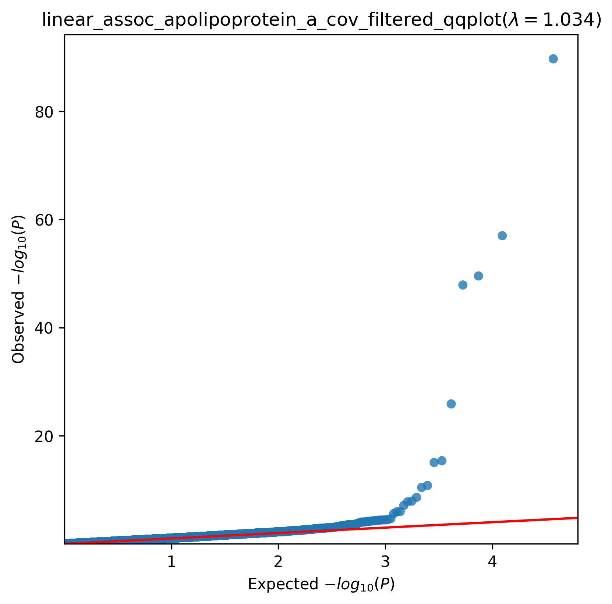
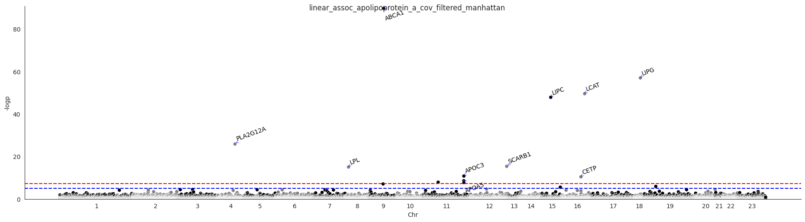

.. _apolipoprotein-a:

`Back to overview <https://genrisk.readthedocs.io/en/latest/real_cases.html#other-phenotypes>_`

Apolipoprotein A Association Analysis
==============================================
Download :download:`full summary statistics <../../association_results/linear_assoc_apolipoprotein_a_cov_filtered.csv>`

.. csv-table:: Apolipoprotein A associations
   :delim: ;
   :header-rows: 1

    genes;p_value;beta_coef;std_err;fdr_bh_adj_pval
    ABCA1;1,96E-74;-0.0005275200923397219;2,61E+10;3,63E-71
    LIPG;1,02E-41;0.0006679423602887556;4,17E+10;9,43E-39
    LCAT;2,81E-35;-0.0013450991645230753;9,02E+10;1,74E-30
    LIPC;1,33E-32;0.0006281929912047672;4,29E+11;6,15E-30
    PLA2G12A;1,33E-10;-0.0003076175879770702;2,88E+11;4,95E-08
    SCARB1;4,23E+00;0.00039689603313202565;4,88E+10;1,31E+04
    LPL;9,03E-01;-0.0006727645241929087;8,37E+10;2,39E+03
    APOC3;1,61E+04;0.000948428344648952;0.0001407614346604517;3,74E+07
    CETP;3,71E+05;0.0005237687354956339;7,92E+10;7,65E+07
    APOA5;2,54E+06;-0.0003772017640353257;6,33E+10;4,72E+08
    NR1H3;1,27E+08;0.0003099203739073528;5,45E+11;2,14E+11
    APOA1;1,73E+06;-0.00046771669722533093;8,30E+10;2,67E+09
    ALDOB;8,24E+07;0.00016259619589188104;3,03E+11;0.00011761858900247704
    LDLR;1,08E+10;-0.00027415226892674437;5,62E+09;0.0014339641913255344
    ANGPTL8;1,20E+10;0.00032711435015152197;6,74E+09;0.0014832714057442125
    PLIN1;2,60E+10;0.0001649378960828924;3,51E+11;0.003013453442768134
    SOAT2;2,18E+11;-0.00014226812347342558;3,35E+10;0.023761920021342826
    STAB1;3,12E+11;8,16E+10;1,96E+11;0.03216956606313687
    PPARG;3,75E+09;-0.0005419451701929831;0.0001314662812976376;0.03531127925754532
    TPD52L2;3,81E+10;0.00035319235048341925;8,57E+10;0.03531127925754532
    KLK9;4,02E+10;0.0002976551181576995;7,25E+10;0.03552265204419214
    YTHDC2;4,24E+10;-0.0001554675681705547;3,80E+10;0.03575071006416247
    HIST1H2AJ;4,78E+11;-0.0004816740340731363;0.00011844952300958906;0.038526764422004235
    MLXIPL;5,54E+10;-0.0001268194566253371;3,15E+11;0.042485151073389134
    UPK3BL1;5,72E+10;-0.0006513111472931742;0.00016185491842335268;0.042485151073389134
    TACR1;6,42E+10;-0.0002139757045733276;5,35E+10;0.04580855597750819
    PKD1;6,77E+10;-6,46E+10;1,62E+11;0.0465323307175163
    NEK7;7,09E+10;0.00024331344343368777;6,12E+10;0.04696700556934567
    ADH1B;8,94E+10;0.00013825293584975707;3,53E+10;0.05654911057550411
    INS;9,23E+09;0.002685852376591825;0.0006869169616475603;0.05654911057550411

The QQ-plot:
------------

The Manhattan plot:
--------------------

