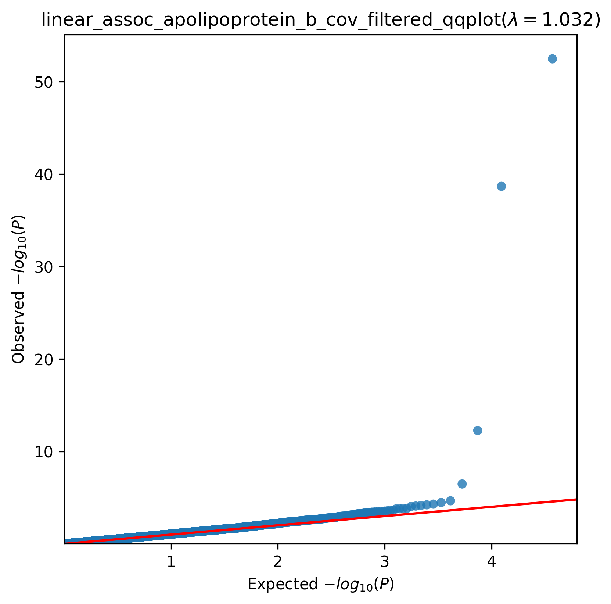
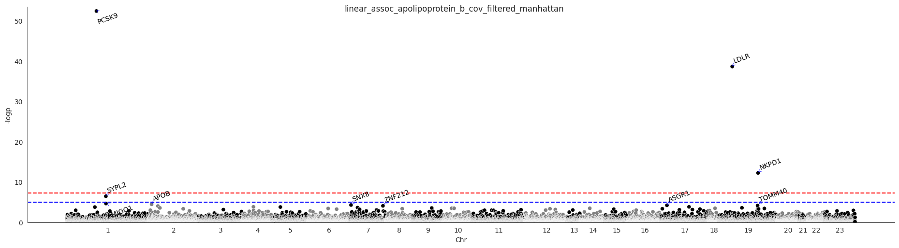

.. _apolipoprotein_b:

`Back to overview <https://genrisk.readthedocs.io/en/latest/real_cases.html#other-phenotypes>_`

Apolipoprotein B Association Analysis
==============================================
Download :download:`full summary statistics <../../association_results/linear_assoc_apolipoprotein_b_cov_filtered.csv>`

.. csv-table:: Apolipoprotein B associations
   :delim: ;
   :header-rows: 1

    genes;p_value;beta_coef;std_err;fdr_bh_adj_pval
    PCSK9;3,53E-37;-0.0006967442791781413;4,54E+10;6,55E-34
    LDLR;2,16E-23;0.0006980922434707857;5,31E+10;2,00E-20
    NKPD1;5,51E+02;-0.00033470468082991205;4,64E+10;3,41E+07
    SYPL2;3,37E+08;-0.00021511890032934743;4,22E+11;0.001564075233617376
    AMIGO1;2,22E+11;-0.0003575232847371763;8,43E+10;0.08240085719968862
    APOB;3,42E+11;-7,85E+10;1,89E+11;0.10582089653926811
    SNX8;5,10E+11;0.00012485425497575585;3,08E+10;0.13510886339233322
    ASGR1;6,10E+11;-0.00030341348777069833;7,57E+09;0.14152072911108898
    TOMM40;7,18E+10;0.00019958021690341302;5,03E+10;0.14805641870691486
    ZNF212;8,22E+10;-0.00011061434853200974;2,81E+11;0.15249827634732785
    ABCG5;9,15E+09;0.0001201409905586524;3,07E+10;0.154396500078962
    UGT2B10;0.00014638902716078997;-0.0001858454472936849;4,89E+11;0.20646298951719397
    C17orf53;0.00014718137683589793;0.00023826328338661382;6,28E+10;0.20646298951719397
    PPWD1;0.0001626923776300813;0.0002406650240151286;6,38E+10;0.20646298951719397
    PRPF38A;0.00016689722153254524;0.0003832879394075585;0.0001018143483430893;0.20646298951719397
    NT5C3A;0.0002299309466813684;0.0002364739636552483;6,42E+09;0.266662415413717
    TM6SF2;0.00025593537255549556;-0.00017219959590048612;4,71E+10;0.27608684906911674
    RTN4;0.00026881082116135665;-0.00010134278913357097;2,78E+10;0.27608684906911674
    PSMD5;0.00028975138612315844;0.0001645071450954862;4,54E+10;0.27608684906911674
    A1CF;0.00033330650556445083;0.00015435395353717514;4,30E+10;0.27608684906911674
    SAV1;0.000333519311659985;0.00027632174806352546;7,70E+10;0.27608684906911674
    AIFM2;0.00033609147174577244;0.00010456860168057577;2,92E+10;0.27608684906911674
    DYM;0.00034220723909192093;-0.00014017137965756626;3,91E+09;0.27608684906911674
    FCGRT;0.0003681455169521198;0.00014990319457937464;4,21E+09;0.27850548056928154
    KLC4;0.00037522294752274406;0.00013853081538482744;3,89E+10;0.27850548056928154
    TRIQK;0.00042294713504323843;-0.0007371481111663123;0.00020909529395803954;0.2880638549763136
    SMYD4;0.0004384988872231121;-0.00015886729318190658;4,52E+10;0.2880638549763136
    PPM1H;0.0004414141225647685;-0.00019074426559506654;5,43E+11;0.2880638549763136
    PRKRA;0.00045019679857259616;-0.00031713309292012997;9,04E+10;0.2880638549763136
    RTN2;0.0004943645701596887;0.0002086352200076642;5,99E+10;0.30578096546277284

The QQ-plot:
------------

The Manhattan plot:
--------------------

