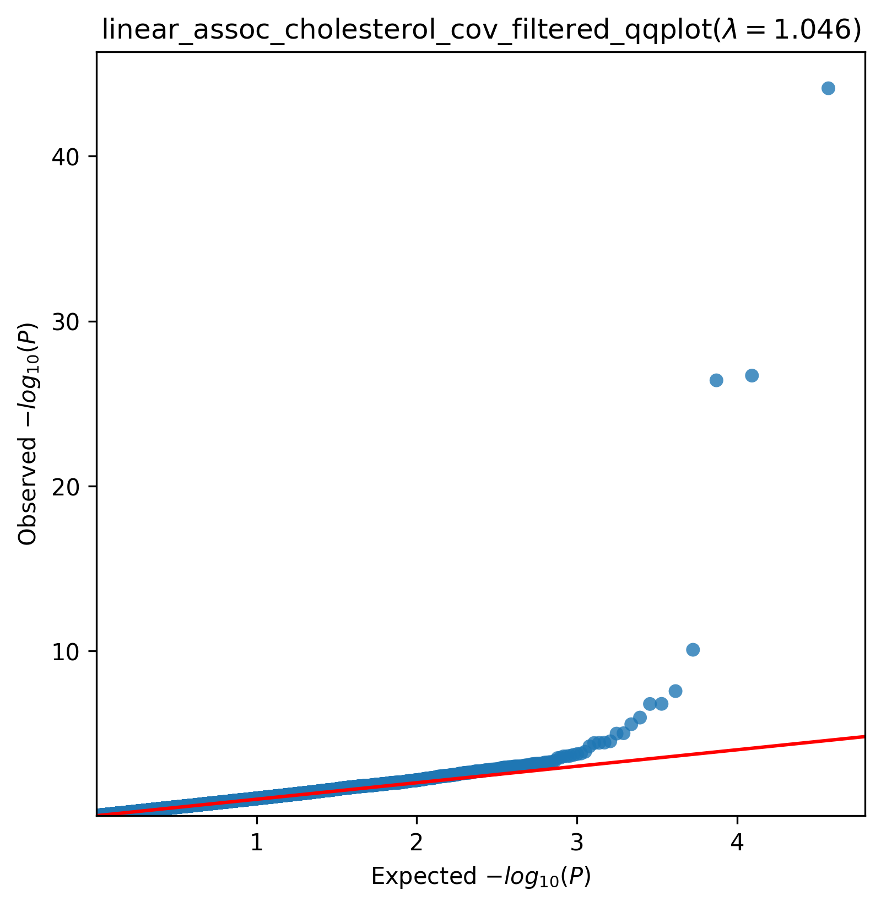

.. _cholesterol:

`Back to overview <https://genrisk.readthedocs.io/en/latest/real_cases.html#other-phenotypes>_`

Cholesterol Association Analysis
==============================================
Download :download:`full summary statistics <../../association_results/linear_assoc_cholesterol_cov_filtered.csv>`

.. csv-table:: Cholesterol associations
   :delim: ;
   :header-rows: 1

    genes;p_value;beta_coef;std_err;fdr_bh_adj_pval
    PCSK9;7,65E-30;-0.00300889425811855;0.00021407583751495928;1,42E-24
    LDLR;2,04E-11;0.002724519607594507;0.00025110092734483415;1,89E-07
    ABCA1;3,94E-11;-0.0012618170670939091;0.00011694648229088578;2,44E-07
    LIPG;8,61E+03;0.0012038015834374511;0.00018548751476435757;4,00E+08
    TM6SF2;2,78E+07;-0.0012371641026031573;0.00022269954345420018;0.00010302627514318664
    SCARB1;1,65E+09;0.001129256154360847;0.0002156839087638414;0.00044214443690955487
    LCAT;1,67E+09;-0.002080248163657814;0.0003975066029530842;0.00044214443690955487
    SNX8;1,12E+10;0.0007091151917813531;0.00014560792010042062;0.002590817452176296
    NKPD1;2,83E+10;-0.0010267030158622181;0.00021923965258303086;0.005833550324879528
    UGT2B10;9,94E+09;-0.0010222713719850022;0.00023135733477055951;0.01764834097996257
    SYPL2;1,05E+11;-0.0008770540045065847;0.0001989888416614508;0.01764834097996257
    CLDN10;3,06E+10;0.0017186469779218285;0.00041226194703310946;0.0473725331353151
    NPC1L1;3,68E+11;-0.0006334723660248461;0.0001534904613779326;0.04829196874081976
    MRPL32;3,80E+10;-0.0004490562753531443;0.00010900354343681273;0.04829196874081976
    ANGPTL3;3,90E+10;-0.0006793123478695299;0.00016515299948727239;0.04829196874081976
    KLC4;6,19E+10;0.000736832275807513;0.00018395603440322247;0.07181441711780674
    RTN4;0.00013239215422936035;-0.000502016992877468;0.00013134694897052037;0.1445099302282359
    AANAT;0.00016764969914559701;-0.001477289667025024;0.00039253580786937064;0.172828212074761
    ABCG5;0.00018272504229454526;0.0005431801895770949;0.0001451627031718685;0.1784550465693464
    FGB;0.00020373351435125155;0.0006184815433115849;0.00016650752495635606;0.18902395461509117
    DYM;0.00023232751731402135;-0.0006809397416657358;0.0001849834366855969;0.2041359198081407
    FCGRT;0.000248919394456015;0.0007287757838748351;0.00019893100726150128;0.2041359198081407
    NT5C3A;0.0002530246904282839;0.001107380638503238;0.00030262342500290545;0.2041359198081407
    HSD17B2;0.00029897774201121427;-0.0008064017010155383;0.000222992567687391;0.2311596241983372
    PRPF38A;0.0003193842428764571;0.001729134715483418;0.0004804307241895775;0.2370597604326215
    RFX3;0.0004690818361113982;0.0011261194862616467;0.0003219418488593306;0.33478009811088866
    ZFP28;0.0005571397172568008;0.0011452008886700647;0.0003317748332309325;0.36957292446674983
    H1F0;0.0005576655467271499;-0.003691719334463345;0.001069602654176048;0.36957292446674983
    PROC;0.000583718331869453;0.001389938534794349;0.00040415236310204644;0.3702474591322339
    OR6C75;0.0005985893389721393;0.0016642705384065592;0.0004848809442227479;0.3702474591322339

The QQ-plot:
------------

The Manhattan plot:
--------------------

