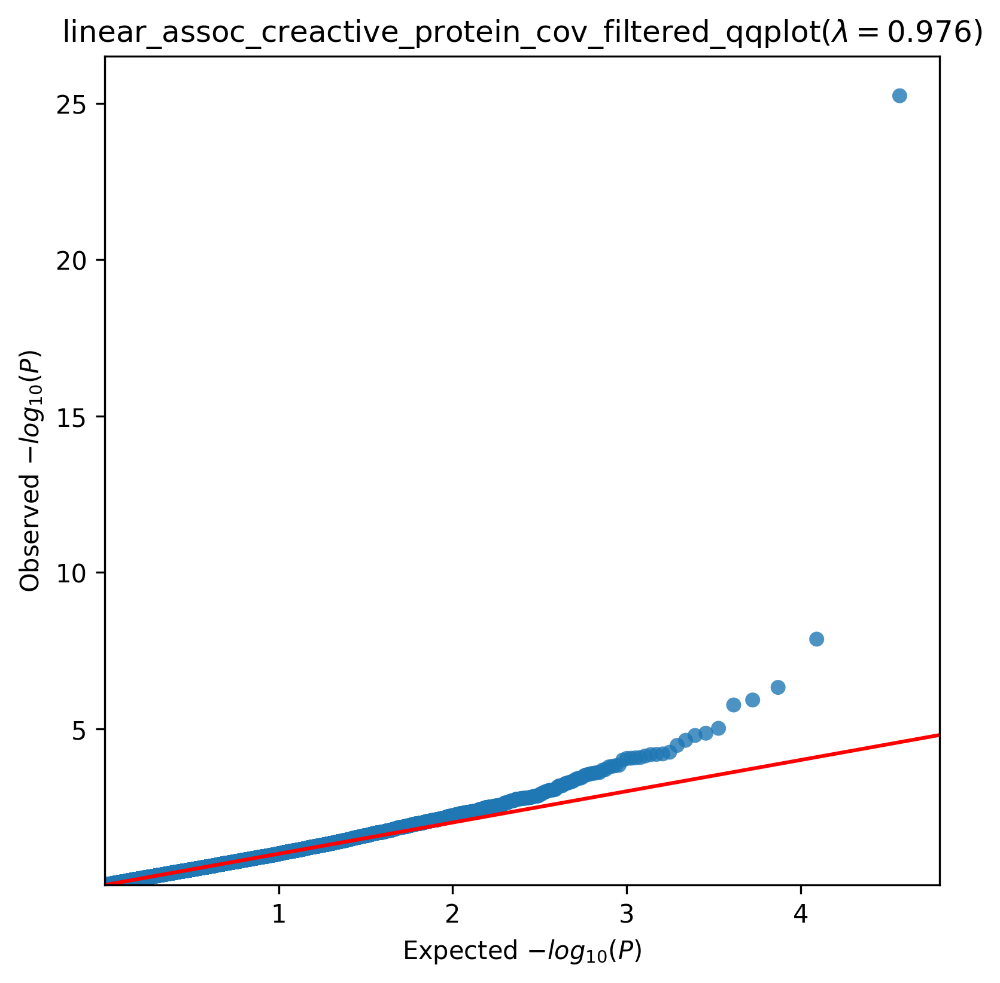
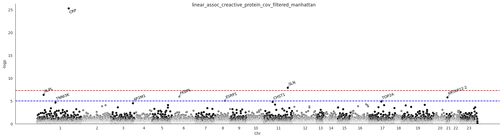

.. _creactive-protein:

`Back to overview <https://genrisk.readthedocs.io/en/latest/real_cases.html#other-phenotypes>_`

C-reactive Protein Association Analysis
==============================================
Download :download:`full summary statistics <../../association_results/linear_assoc_creactive_protein_cov_filtered.csv>`

.. csv-table:: C-reactive Protein associations
   :delim: ;
   :header-rows: 1

    genes;p_value;beta_coef;std_err;fdr_bh_adj_pval
    CRP;5,70E-11;-0.011565962287441268;0.0010972144612963295;1,06E-06
    SLN;1,37E+08;0.0703790816015586;0.01239496843033436;0.00012665296181478078
    ALPL;4,77E+09;0.0035681568124903943;0.0007085708257920073;0.0029482447942825803
    FKBPL;1,21E+10;0.007540389961969952;0.0015531523196463397;0.005593525015133995
    KRTAP22-2;1,74E+10;0.10349028542513651;0.021643375810691028;0.00645982014769157
    ESRP1;9,71E+09;0.005053372406815255;0.0011423326985815286;0.0300240149705481
    TOP2A;1,39E+11;0.002902426444086085;0.0006679468277002653;0.03689530395585989
    CHST1;1,64E+11;0.010889595270657053;0.0025272220491496483;0.03807741033803267
    TNNI3K;2,35E+11;0.06856907637295753;0.016214275530512252;0.048440728930204124
    AP2M1;3,41E+11;0.018489508357710807;0.004461269251485485;0.06324309373977618
    PSMD7;5,65E+10;0.007277139617184005;0.001807038722594254;0.08693881449282005
    C19orf70;6,39E+10;0.011099814344303403;0.0027762582110146625;0.08693881449282005
    APLNR;6,61E+10;0.0035183094525522286;0.000881811021665979;0.08693881449282005
    C21orf2;6,73E+10;0.003787131863282193;0.0009501979654355287;0.08693881449282005
    INAFM1;7,46E+10;0.006400335715195443;0.0016157817797620593;0.08693881449282005
    HAVCR1;8,33E+10;0.009271508074835783;0.0023562498870760844;0.08693881449282005
    MLYCD;8,55E+10;0.003261791580553655;0.0008302980540143521;0.08693881449282005
    G6PC;8,79E+10;0.004051696985480109;0.0010331220782537913;0.08693881449282005
    IDH1;8,90E+10;0.004269158960289905;0.0010893951359763092;0.08693881449282005
    VMAC;0.0001001646881233042;0.0037683369829565024;0.0009686492720961875;0.09293279764080163
    HS3ST4;0.0001472608397917653;0.005103849195235555;0.0013446240105088616;0.12866387613574204
    MTX2;0.0001528937427238338;0.006176144806769861;0.001631129678648271;0.12866387613574204
    ZCCHC14;0.00015947775119217866;0.005443859965521194;0.0014417284178364438;0.12866387613574204
    TMTC3;0.00016679094148452445;0.003942828556102429;0.0010473055108796956;0.12895719625778482
    CD9;0.0002009169639519141;0.00576491829377412;0.0015505613215764003;0.14912860732366873
    DDX39A;0.00021075197793719188;0.007373934144890899;0.0019898031815909632;0.1504120654847128
    RHBDL3;0.0002510084456781147;0.004751966986957943;0.0012978836560998042;0.167856131715273
    SPANXN1;0.00025455795543413636;-0.05067856401183393;0.013855230235985325;0.167856131715273
    SLC25A20;0.00026593549146463133;0.0045393506189068105;0.001244853417577906;0.167856131715273
    UBE3A;0.000271377664984813;0.010806619540334468;0.0029678059527621483;0.167856131715273

The QQ-plot:
------------

The Manhattan plot:
--------------------

