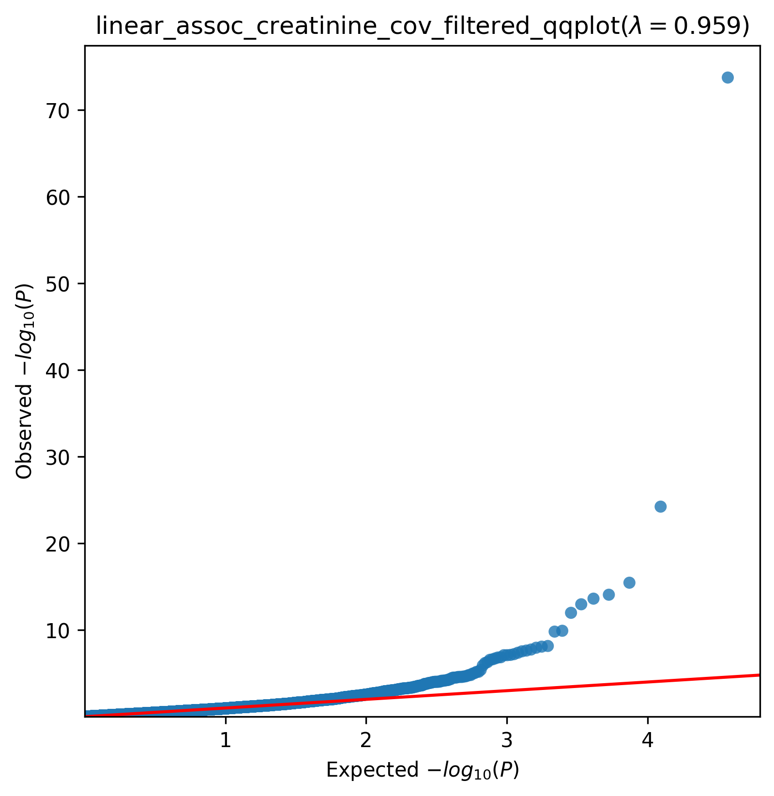
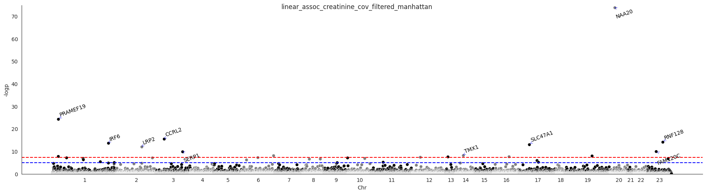

.. _creatinine-serum:

`Back to overview <https://genrisk.readthedocs.io/en/latest/real_cases.html#other-phenotypes>_`

Creatinine (in serum) Association Analysis
==============================================
Download :download:`full summary statistics <../../association_results/linear_assoc_creatinine_cov_filtered.csv>`

.. csv-table:: Creatinine (in serum) associations
   :delim: ;
   :header-rows: 1

    genes;p_value;beta_coef;std_err;fdr_bh_adj_pval
    NAA20;1,82E-59;0.24076389039510535;0.013179939422150493;3,38E-55
    PRAMEF19;5,83E-10;0.10368431339218882;0.010046788138550804;5,41E-05
    CCRL2;3,49E+00;0.05354118210306402;0.006564759164769812;2,16E+03
    RNF128;8,49E+00;0.02123537842656351;0.0027362288138128295;3,94E+05
    IRF6;2,41E+01;0.062467405496714694;0.008189970549101614;8,95E+03
    SLC47A1;1,08E+02;0.020944397563048667;0.0028182583626118664;3,33E+06
    LRP2;1,04E+04;-0.00897727398085211;0.0012598245805468468;2,76E+07
    FAM120C;1,22E+05;0.06208047793448096;0.009644473426136523;2,84E+08
    SERP1;1,53E+06;0.1784721848989242;0.027874457775190594;3,16E+09
    TMX1;6,95E+06;0.035159796612716364;0.006069996894968527;1,29E+11
    SLC22A2;8,27E+06;0.01976175835660956;0.003429014887181134;1,40E+11
    CEACAM7;1,11E+08;0.0667823679095958;0.01168861748891767;1,72E+11
    PRAMEF8;1,79E+08;0.09051100212391505;0.016071853485194822;2,55E+11
    MT1E;2,36E+08;0.08900343033829959;0.015939225216977947;3,12E+10
    ALOX5AP;2,88E+08;0.05363947023282221;0.009666276173537451;3,56E+11
    ETFRF1;4,21E+07;0.04092921822796622;0.007465985486609255;4,88E+10
    SLC22A7;6,08E+07;0.01669317933244599;0.0030817740500267282;6,64E+07
    FAM229A;7,45E+07;0.06603839027475451;0.012274400513927088;7,48E+10
    SP140;7,99E+06;0.036162170836869525;0.0067372153036452075;7,48E+10
    SLC34A3;8,07E+07;0.01150587282833939;0.0021442446634412395;7,48E+10
    PSMA5;1,38E+09;0.12350629193405574;0.023442361229558065;0.00012170225228071206
    LDB1;1,49E+09;0.05340301197302065;0.010164060466072291;0.00012563872385047798
    MAGEC3;1,90E+09;0.038729888578498926;0.007435544023123177;0.00015359170096815566
    ASAP1;2,43E+09;0.020498651419113438;0.003970171446438413;0.00018797803117087073
    EIF4EBP1;2,75E+08;0.04493649637675978;0.008742742470526846;0.0002043342525434564
    AMPD2;5,05E+08;0.01891937421354294;0.0037652737100191515;0.00036028181465513063
    HIST1H4F;6,40E+08;0.033952576354921916;0.006819229353642636;0.0004398759514080643
    KRTAP1-4;1,23E+10;0.043197920814553974;0.008903826674685084;0.0008124077625236029
    SLC19A2;4,05E+09;0.024048180385967392;0.005217500115558427;0.0025894195966830375
    KRT9;6,63E+09;0.014245293065467813;0.0031617557471833114;0.004044294137679626

The QQ-plot:
------------

The Manhattan plot:
--------------------

