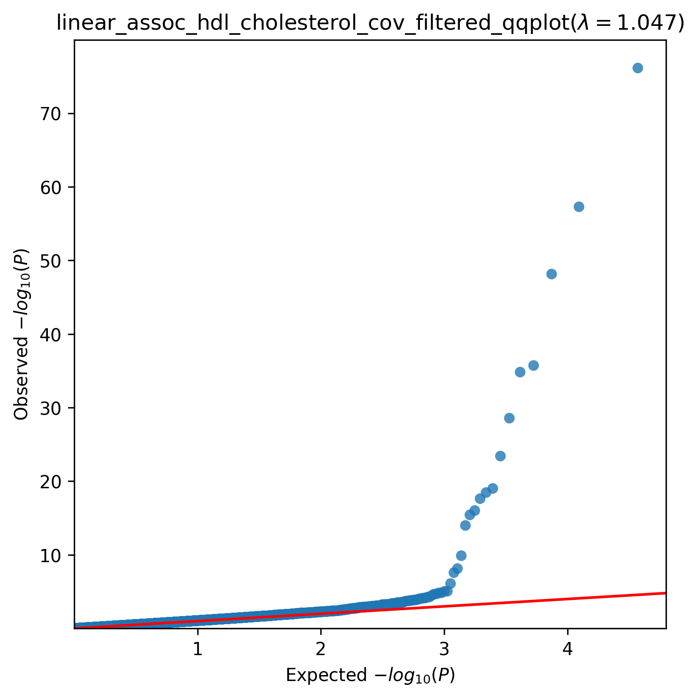
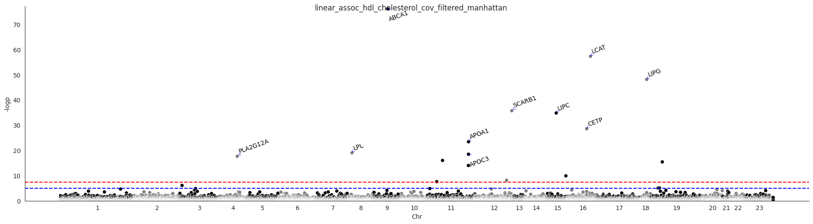

.. _hdl:

`Back to overview <https://genrisk.readthedocs.io/en/latest/real_cases.html#other-phenotypes>_`

HDL Cholesterol Association Analysis
==============================================
Download :download:`full summary statistics <../../association_results/linear_assoc_hdl_cholesterol_cov_filtered.csv>`

.. csv-table:: HDL Cholesterol associations
   :delim: ;
   :header-rows: 1

    genes;p_value;beta_coef;std_err;fdr_bh_adj_pval
    ABCA1;7,23E-62;-0.0006612553782648262;3,56E+10;1,34E-56
    LCAT;5,16E-43;-0.0019785215817000705;0.00012316439336261222;4,79E-38
    LIPG;7,14E-34;0.0008295292414690313;5,64E+11;4,42E-29
    SCARB1;1,89E-20;0.0008345317813111246;6,62E+09;8,76E-19
    LIPC;1,49E-20;0.0007245483827154861;5,82E+10;5,54E-17
    CETP;2,70E-14;0.0012024479012290193;0.00010698757609997397;8,35E-11
    APOA1;3,84E-10;-0.0011429443731198674;0.00011274280796717756;1,02E-04
    LPL;9,60E-05;-0.0010351733013310004;0.00011382050972930136;2,23E+00
    APOC3;3,46E-04;0.0016876661908868387;0.00018847256384005935;7,13E-01
    PLA2G12A;2,31E-02;-0.00034369493475368116;3,93E+10;4,29E-01
    NR1H3;9,60E-03;0.0006160125580873325;7,41E+09;1,62E+03
    ANGPTL8;3,74E+00;0.0007438250001389655;9,13E+09;5,78E+02
    APOA5;1,02E+01;-0.0006659457386253521;8,61E+09;1,46E+05
    PLIN1;1,31E+06;0.00030661631071808354;4,77E+10;1,73E+09
    SH2B3;7,32E+06;-0.0002335837012388507;4,04E+10;9,05E+09
    PDE3B;2,62E+08;0.0001961810088616186;3,52E+10;3,04E+10
    PPARG;7,95E+08;-0.0008821290965387105;0.0001786867305332758;0.0008681645502077209
    ANGPTL4;8,83E+09;0.00022742408072141338;5,12E+11;0.008936461094241831
    INSR;9,15E+09;0.00018164495994374928;4,09E+10;0.008936461094241831
    INS;1,44E+11;0.004057040971291178;0.0009354209667430744;0.01292878111920499
    CCDC66;1,46E+11;-0.00010619206737304276;2,45E+10;0.01292878111920499
    SOAT2;2,03E+10;-0.0001945298510069164;4,57E+11;0.017151891112085926
    NEK7;2,19E+10;0.00035298923775172776;8,32E+10;0.017655320169763965
    PLTP;3,40E+11;-0.00022692200286069216;5,47E+10;0.02627236216511789
    STAB1;5,34E+10;0.00010786682667430507;2,67E+10;0.03951131620703466
    PKD1;5,54E+10;-8,91E+10;2,21E+11;0.03951131620703466
    PTGER1;7,34E+09;0.00024748017238926113;6,24E+10;0.04911060123795259
    ALDOB;7,41E+10;0.0001636547435275993;4,13E+10;0.04911060123795259
    TPD52L2;8,80E+10;0.0004552458948936724;0.00011608822448369492;0.056323643075246885
    NDUFA1;9,18E+10;0.003782241488235982;0.0009669442633949297;0.056753280393966876

The QQ-plot:
------------

The Manhattan plot:
--------------------

