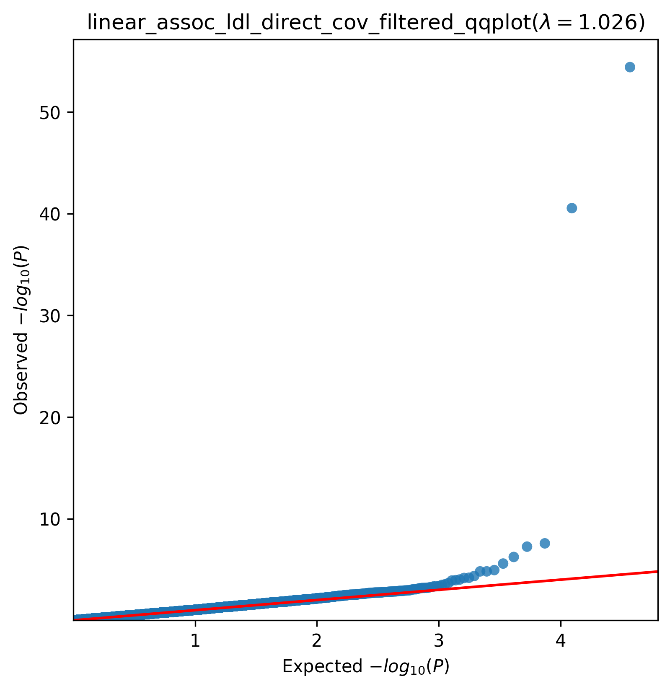
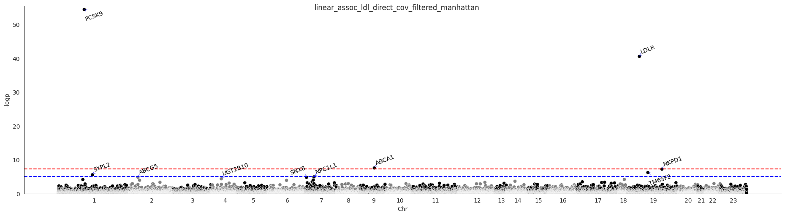

.. _ldl:

`Back to overview <https://genrisk.readthedocs.io/en/latest/real_cases.html#other-phenotypes>_`

LDL direct Association Analysis
==============================================
Download :download:`full summary statistics <../../association_results/linear_assoc_ldl_direct_cov_filtered.csv>`

.. csv-table:: LDL direct associations
   :delim: ;
   :header-rows: 1

    genes;p_value;beta_coef;std_err;fdr_bh_adj_pval
    PCSK9;4,01E-40;-0.0025786959165188484;0.00016482954439598173;7,44E-36
    LDLR;2,95E-25;0.002601598863175734;0.00019332095625362985;2,74E-21
    ABCA1;2,70E+08;-0.0005009057353384961;9,01E+10;0.00016673278181074044
    NKPD1;5,67E+07;-0.0009162381279347418;0.00016875982961265571;0.00026295619196431994
    TM6SF2;5,87E+08;-0.0008567376835275061;0.00017149055459064687;0.0021766524940778813
    SYPL2;2,61E+09;-0.0007201165335560541;0.00015323644762124046;0.008077700194261673
    NPC1L1;1,15E+11;-0.0005185526315274678;0.00011818277491835216;0.030385940200183762
    SNX8;1,53E+11;0.0004848756068884617;0.0001121319814026632;0.03169845591191435
    ABCG5;1,54E+10;0.000483176445883284;0.0001117583875556234;0.03169845591191435
    UGT2B10;4,36E+10;-0.0007280670448653034;0.00017810737136024984;0.080852149730374
    DYM;6,47E+09;-0.0005689148841140008;0.00014240867729197314;0.10498495555128838
    PRPF38A;6,79E+10;0.0014738306563781098;0.00036996830045477177;0.10498495555128838
    MRPL32;9,71E+10;-0.00032719043171652043;8,39E+10;0.1386186164062808
    RTN4;0.00011218867956985448;-0.0003906492293908611;0.00010113369086547106;0.14869808129273
    KLC4;0.00012177258351914862;0.0005443554111826351;0.00014166205035029015;0.15064080398542146
    SAV1;0.00022041199241788794;0.0010351588076725872;0.0002801901482956863;0.25562280820664557
    NT5C3A;0.00028929950850400905;0.0008447402333681179;0.00023304555229018407;0.31577892234119953
    ASGR1;0.0003271675384519309;-0.0009903392362244682;0.000275640391653774;0.33727338019522385
    PRKRA;0.00042764887910216594;-0.0011613149948911225;0.0003296860943653048;0.4055945848039006
    HOXB8;0.0004371573451216864;0.0026808077434251325;0.0007623179103564675;0.4055945848039006
    CCDC38;0.00046721398632807945;0.0007381825873894954;0.00021097192452433487;0.4128391776335163
    C17orf53;0.0005224869741434539;0.0007912319718860228;0.00022808432182379757;0.4406940132820878
    ZFP28;0.0006067683480453384;0.0008760005522130922;0.0002554946098911123;0.4674417911830231
    PPWD1;0.0006382294366700523;0.0007930096945541216;0.00023222050311372223;0.4674417911830231
    TNRC18;0.0006460041579735054;0.00028065326907733876;8,23E+10;0.4674417911830231
    ZNF212;0.0006549626304569196;-0.00034892906251756485;0.00010239000233823331;0.4674417911830231
    AANAT;0.0006863375132433415;-0.0010262776570232656;0.00030228623675551783;0.47169181095346085
    PLA2G12A;0.0007739974280037118;0.00033287449677887475;9,90E+10;0.5129391526441742
    ABCA8;0.0008707202818252056;0.0002906074919861864;8,73E+10;0.5412076683990658
    CLDN10;0.0008843750774425048;0.0010556345583696554;0.0003174832113033704;0.5412076683990658

The QQ-plot:
------------

The Manhattan plot:
--------------------

