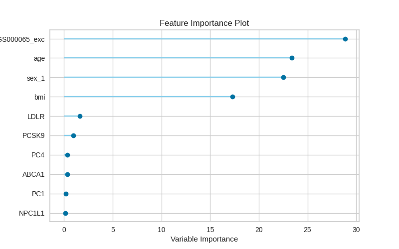

.. _ldl_results:
Real use case
###############
We ran the pipeline using about 200K samples from UKBiobank.
We filtered for British to remove outliers and calculated the scores using 1% MAF threshold, beta 1-25 weighting parameter and CADD raw scores.

Association analysis
*********************
We ran association analysis on the samples with LDL direct measurements as phenotype(quantitative).
We used linear regression for the analysis and age, sex, BMI and PC1-4 were used as covaraites.
The association analysis highlighted PCSK9 and LDLR as significant genes, both are known to be associated with LDL.
QQ-plot and Manhattan plot are presented below.

The QQ-plot:

.. image:: ../../ldl_example/linear_assoc_ldl_200k_qqplot.png
    :width: 400
    :align: center

The Manhattan plot:

.. image:: ../../ldl_example/linear_assoc_ldl_200k_manhattan.png
    :width: 400
    :align: center

Regression model
*****************
For the prediction model, we used LDL direct measurements are target. For features, we used the scores of 477 selected genes (https://doi.org/10.1038/nrg2779) + BMI + age + sex + PC1-4.
We also used PRS (PGS000065), to avoid colinearty, we excluded variants that were included in the gene scores from the PRS calculation.
We then ran the pipeline using 25% of the dataset as external testing set and 75% were used in training with 10-fold cross-validation.
The final prediction model was generated using gradiant boosting regression (CatBooster) which had an Rˆ2 of  0.1412 and an RMSE of 0.8035.

Feature importance plot:

Actual vs Predicted:

.. image:: ../../ldl_example/regressor_scatterplot.png
    :width: 400
    :align: center

Model residuals:

.. image:: ../../ldl_example/Residuals.png
    :width: 400
    :align: center

