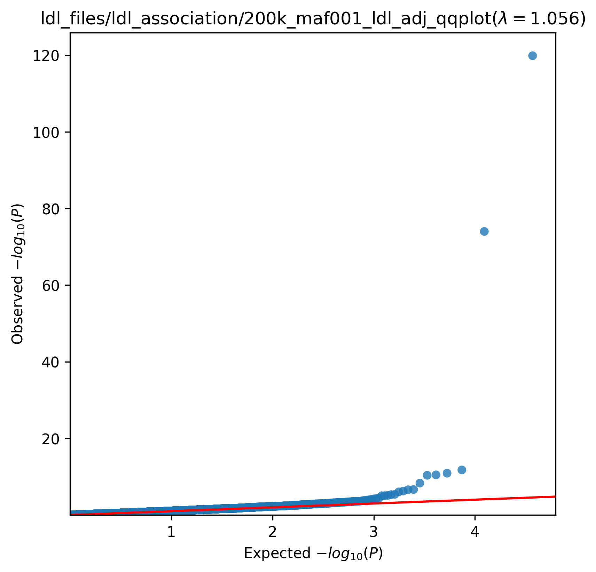
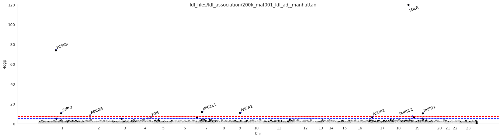
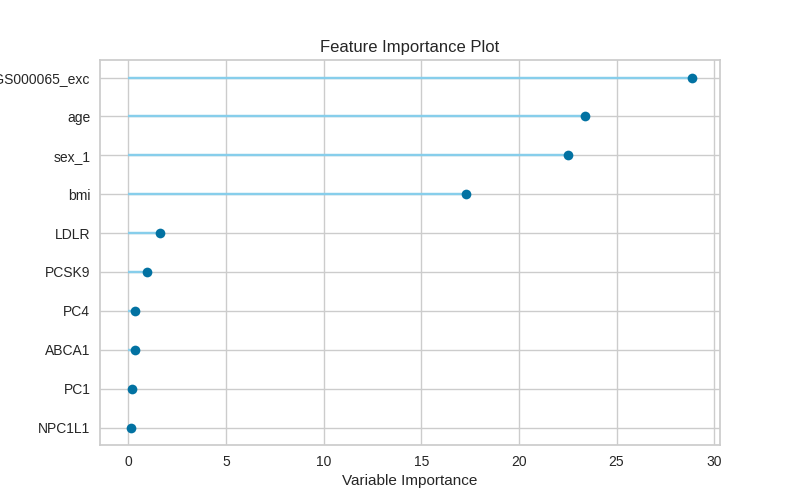
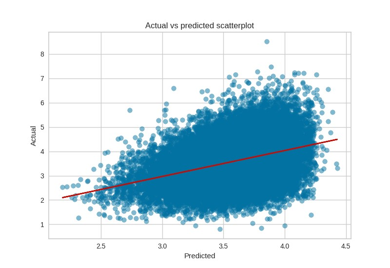
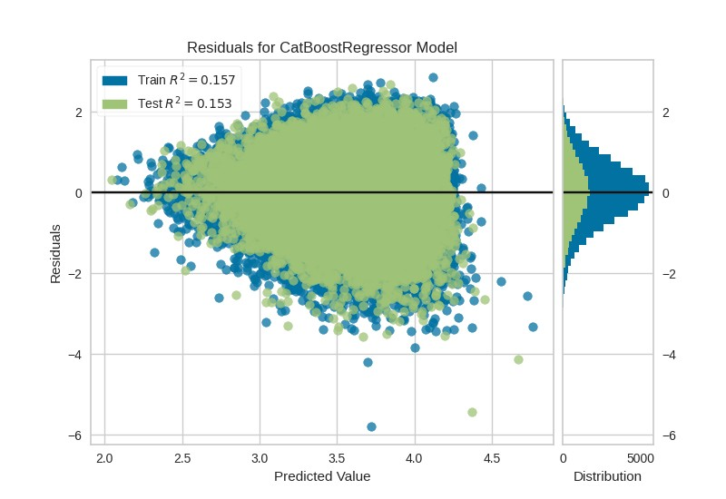
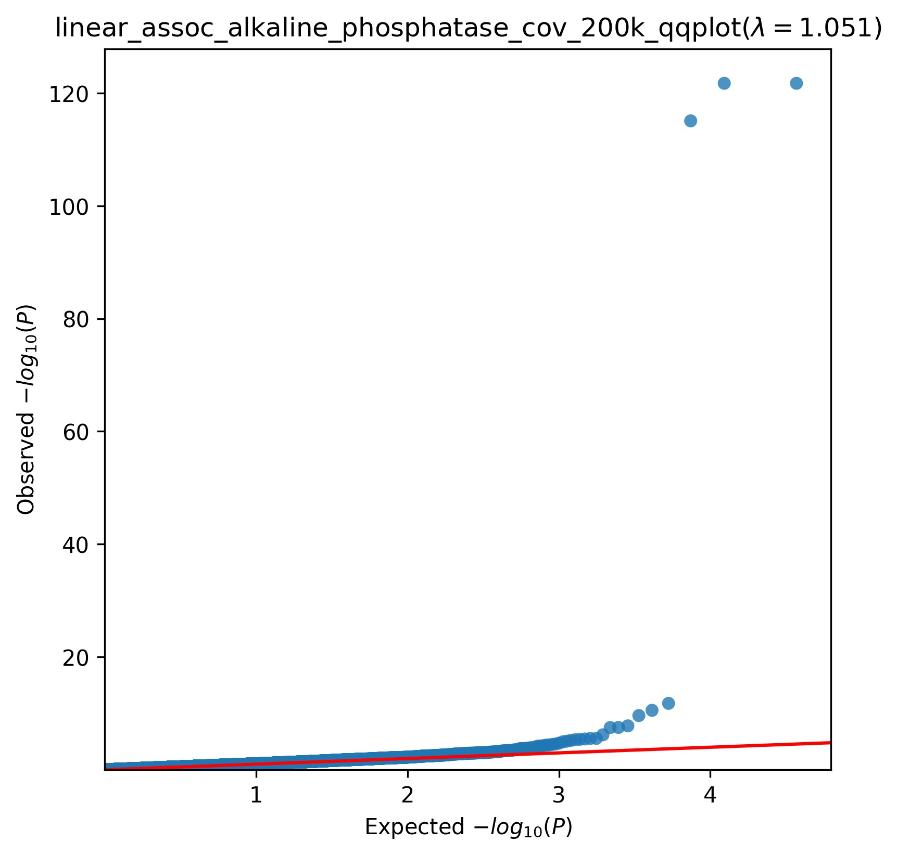
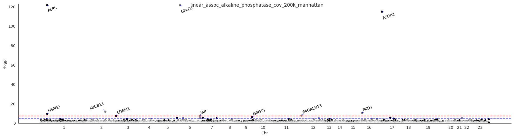
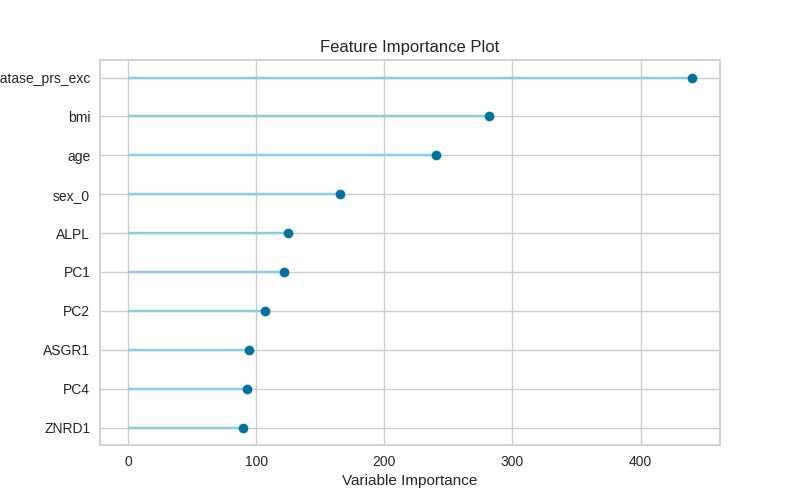

.. _real-cases:
Real use case
###############

.. topic:: Data

    We ran the pipeline using about 200K samples from UKBiobank. We filtered for British to remove outliers (150K after filtering)

.. topic:: Gene scoring

    We calculated the scored for the 150K samples.

    :MAF threshold:
        1% MAF threshold.

    :Weighting function:
        beta 1-25 weighting parameter.

    :Functional annotation:
        CADD raw scores.

.. topic:: Association analysis

    For each phenotype, we performed association analysis including all the samples (150K)

    :Method:
        linear regression

    :Covarites:
        age, sex, BMI and PC1-4

.. topic:: Prediction models

    We also generated 3 models for each phenotype, a PRS prediction model, a gene-based prediction model and a combined model.

    :Feature Selection:
        we used portion of the samples (50K) for feature selection with linear regression. The genes with p-values <0.05 were selected as features.

    :Covariates:
        age, sex, BMI and PC1-4 were also included in the features.

    :model trainng:
        Of the remaining 100K samples, 75% were used in training with 10-fold cross-validation.

    :model testing:
        the 25% remaining of the dataset was used as external testing set for final model evaluation.

    :PRS calculation:
        To avoid colinearty, we excluded variants that were included in the gene scores from the PRS calculation.

LDL Phenotype
***************
We performed the analysis on the samples with LDL direct measurements as phenotype(quantitative).

.. note::
    For this phenotype we adjusted the values for individuals who take statin.

Association analysis
---------------------
The association analysis highlighted PCSK9 and LDLR as significant genes, both are known to be associated with LDL.
QQ-plot and Manhattan plot are presented below.

The QQ-plot:

The Manhattan plot:

Regression model
------------------
For the prediction model, we used LDL direct measurements (adjusted for statin) as target.
For features, we used the scores of 3 selected genes + BMI + age + sex + PC1-4.
For the PRS and combined models we used the following PRS (PGS000688).
The final prediction models was generated using gradiant boosting regression, evaluation metric are shown in the table below.

+----------------+------------------+------------+----------------+
|                | Gene-based model | PRS model  | Combined model |
+================+==================+============+================+
|     Rˆ2        |   0.092          |  0.322     |  0.321         |
+----------------+------------------+------------+----------------+
|  RMSE          |     0.849        |  0.729     |  0.725         |
+----------------+------------------+------------+----------------+

The images below are the output of the final combined model.
Feature importance plot:

Actual vs Predicted:

Model residuals:

Alkaline phosphatase
**********************
We performed the analysis on the samples with ALP measurements as phenotype(quantitative).

Association analysis
---------------------
We used linear regression for the analysis and age, sex, BMI and PC1-4 were used as covaraites.
The association analysis highlighted ALPL, GPLD1 and ASGR1 as significant genes, all of which are known to be associated with alkaline phosphatase.
QQ-plot and Manhattan plot are presented below.

The QQ-plot:

The Manhattan plot:

Regression model
------------------
For the prediction model, we used alkaline phosphatase measurements as target. For feature selection,
For features we used 45 selected genes as features (45 genes) + BMI + age + sex + PC1-4.
For the PRS and combined models we used the following PRS (PGS000670).
The final prediction models was generated using gradiant boosting regression, evaluation metric are shown in the table below.

+----------------+------------------+------------+----------------+
|                | Gene-based model | PRS model  | Combined model |
+================+==================+============+================+
|     Rˆ2        |   0.084          |  0.255     |   0.281        |
+----------------+------------------+------------+----------------+
|  RMSE          |   24.7           |  22.3      |    21.9        |
+----------------+------------------+------------+----------------+

Feature importance plot for combined model:

Other phenotypes
******************
Association analysis
---------------------
+----------------------------------+----------------------------------------------------------------------------------------------------------------+
|         biomarker                | Top 3 significantly associated genes                                                                           |
+==================================+================================================================================================================+
|    Alanine aminotransferase      | GPT, THRA, ACVR2B, `More <https://genrisk.readthedocs.io/en/latest/biomarkers/alanine_aminotransferase.html>`_ |
+----------------------------------+----------------------------------------------------------------------------------------------------------------+
|                   Albumin        | FCGRT, ALB, IQGAP2, `More <https://genrisk.readthedocs.io/en/latest/biomarkers/albumin.html>`_                 |
+----------------------------------+----------------------------------------------------------------------------------------------------------------+
|     Alkaline phosphatase         |  ALPL, GPLD1, ASGR1, `More <https://genrisk.readthedocs.io/en/latest/biomarkers/alkaline_phosphatase.html>`_   |
+----------------------------------+----------------------------------------------------------------------------------------------------------------+
|       Apolipoprotein A           |    ABCA1, LIPG, LCAT, `More <https://genrisk.readthedocs.io/en/latest/biomarkers/apolipoprotein_a.html>`_      |
+----------------------------------+----------------------------------------------------------------------------------------------------------------+
|          Apolipoprotein B*       |         PCSK9, LDLR, NKPD                                                                                      |
+----------------------------------+----------------------------------------------------------------------------------------------------------------+
|   Aspartate aminotransferase     |       GOT1, GABRA5, THRA                                                                                       |
+----------------------------------+----------------------------------------------------------------------------------------------------------------+
|                 Cholesterol*     |     PCSK9, LDLR, ABCA1                                                                                         |
+----------------------------------+----------------------------------------------------------------------------------------------------------------+
|      C reactive protein          |    CRP, PTGES3L, SLN                                                                                           |
+----------------------------------+----------------------------------------------------------------------------------------------------------------+
|      Creatinine (in serum)       | NAA20, PRAMEF19, CLIC4                                                                                         |
+----------------------------------+----------------------------------------------------------------------------------------------------------------+
|     Gamma glutamyltranferase     | GGT1, CCL1, RORC                                                                                               |
+----------------------------------+----------------------------------------------------------------------------------------------------------------+
|           Glucose                | G6PC2, GCK, DYNLL1                                                                                             |
+----------------------------------+----------------------------------------------------------------------------------------------------------------+
|     Glycated Haemoglobin (HbA1C) |              HBB, PIEZO1, GCK                                                                                  |
+----------------------------------+----------------------------------------------------------------------------------------------------------------+
|       Lipoprotein A              |           LPA, PLG, MRPL18                                                                                     |
+----------------------------------+----------------------------------------------------------------------------------------------------------------+
|       Triglycerides              |      APOA5I, APOC3, PLA2G12A                                                                                   |
+----------------------------------+----------------------------------------------------------------------------------------------------------------+
 * values adjusted for statin

.. note::
    summary statistics for biomarkers association analysis will be added soon.

Prediction models
------------------
Here we show a table of other phenotypes that we analyzed. For each phenotype we include the number of genes considered
in the models as well as the Rˆ2 of the gene-based model, PRS model and combined model.

+---------------------------+-----------------+------------------+------------+----------------+
|                           | Number of genes | Gene-based model | PRS model  | Combined model |
+===========================+=================+==================+============+================+
|    apolipoprotein a       |       6         |      0.227       |   0.413    |     0.403      |
+---------------------------+-----------------+------------------+------------+----------------+
|    apolipoprotein b*      |         5       |      0.059       |   0.267    |     0.269      |
+---------------------------+-----------------+------------------+------------+----------------+
|aspartate aminotransferase |        57       |       0.039      |   0.124    |      0.128     |
+---------------------------+-----------------+------------------+------------+----------------+
|       Cholesterol*        |       6         |      0.088       |   0.229    |      0.236     |
+---------------------------+-----------------+------------------+------------+----------------+
|       Creatinine          |     128         |      0.228       |    0.454   |      0.448     |
+---------------------------+-----------------+------------------+------------+----------------+
|      Hba1c                |      13         |      0.100       |    0.242   |      0.247     |
+---------------------------+-----------------+------------------+------------+----------------+
|      lipoprotein a        |       3         |      0.004       |    0.582   |      0.603     |
+---------------------------+-----------------+------------------+------------+----------------+
|      Triglyceride         |       5         |      0.143       |    0.316   |      0.315     |
+---------------------------+-----------------+------------------+------------+----------------+
|         urea              |       2         |      0.074       |    0.173   |      0.179     |
+---------------------------+-----------------+------------------+------------+----------------+
|      Urate                |       4         |      0.396       |    0.521   |      0.534     |
+---------------------------+-----------------+------------------+------------+----------------+
 * values adjusted for statin