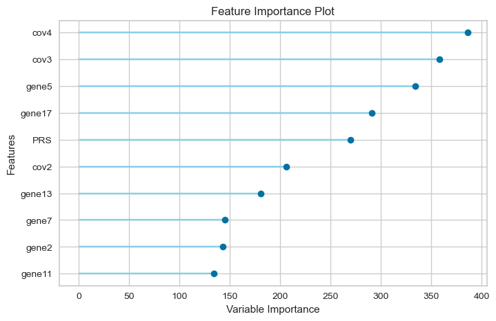
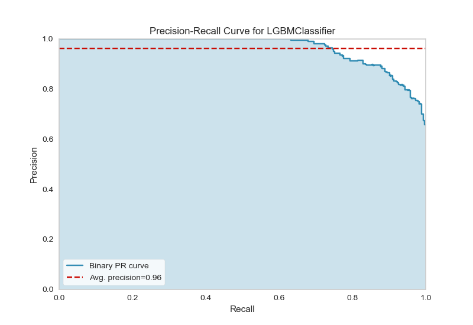
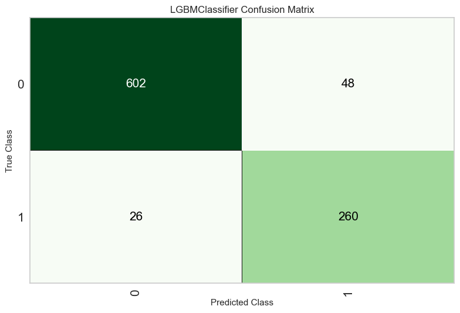
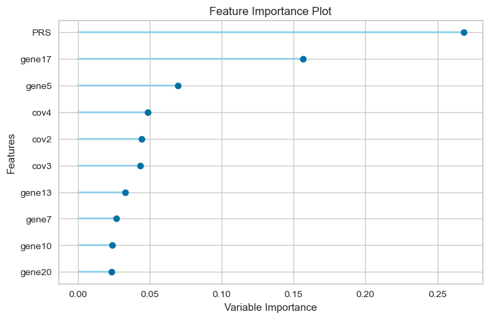
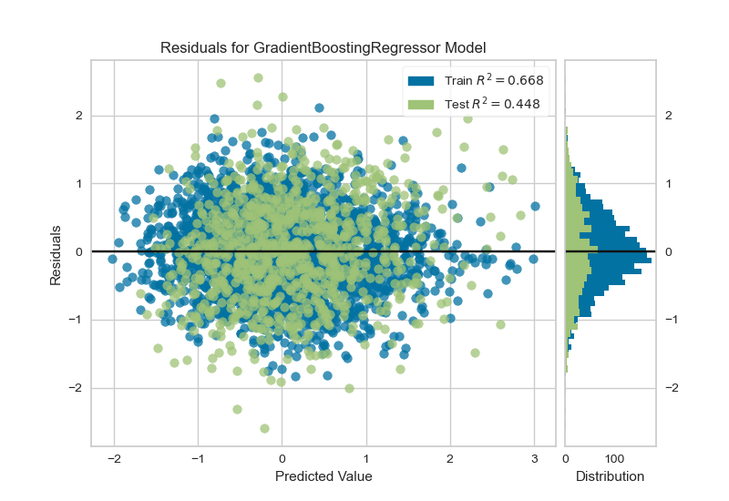

.. _use-example:
Example use case
##################
This toy dataset is not real data. It contains about 10,000 SNP and 20 genes,
2 of which (gene5 and gene17) were synthetically made to produce signals for the included phenotypes.
The signals and phenotypes were simulated using `SIMU <https://github.com/precimed/simu>`_.
It was created for testing and evaluating the pipeline only.
In this example use case, we use the toy dataset to generate gene-based scores, association analysis and machine learning models.

Annotated VCF
**************
(`Click here <https://uni-bonn.sciebo.de/s/WQroVFBQ8NXNnF1>`_ to download VCF)

The annotated vcf contains information about the SNPS, gene, deleteriousness score and allele frequency.
It should also contain samples genotypes. This information is important for the calculation of the gene-based scores.

Gene-based scores
*****************
The gene-based scores can be found `here <https://github.com/AldisiRana/GenRisk/blob/master/toy_example/toy_dataset_scores>`_.
These scores are used as input for the association analysis and as features for the machine learning models.

Association analysis
********************
The association analysis (`found here <https://github.com/AldisiRana/GenRisk/blob/master/toy_example/toy_dataset_betareg_pvals.tsv>`_)
done on the dataset showed significance in gene5 and geen17 as expected.

The QQ-plot was also produced using the pipeline:

.. image:: ../../toy_example/toy_dataset_qqplot.jpeg
    :width: 400
    :align: center

Manhatten plot was not generated because the dataset is small and doesn't contain real data.

Machine learning models
***********************

We have created two types of models, regression and classification. Both models use the gene-based models as features along with artificially simulated covariates, two of these covariates (cov3 and cov4) have significant association with the phenotypes.
For the regression model, a quantitative trait was generated, while a binary trait was generated for the classification model.
For each model, 10 fold cross validation was done on training dataset and an extra evaluation step was done on the testing set.

Classification model
=====================

The input for the model generation can be found `here <https://github.com/AldisiRana/GenRisk/blob/master/toy_example/toy_example_classifier_features.tsv>`_.

Results of model training
++++++++++++++++++++++++++

Feature importance:

Precision-recall curve:

Confusion matrix:

Regression model
==================
The input for the model generation can be found `here <https://github.com/AldisiRana/GenRisk/blob/master/toy_example/toy_example_regressor_features.tsv>`_.

Results for model training
+++++++++++++++++++++++++++

Feature importance:

Prediction error:

.. image:: ../../toy_example/toy_regressor/Prediction_Error.png
    :width: 400
    :align: center

Residuals:

