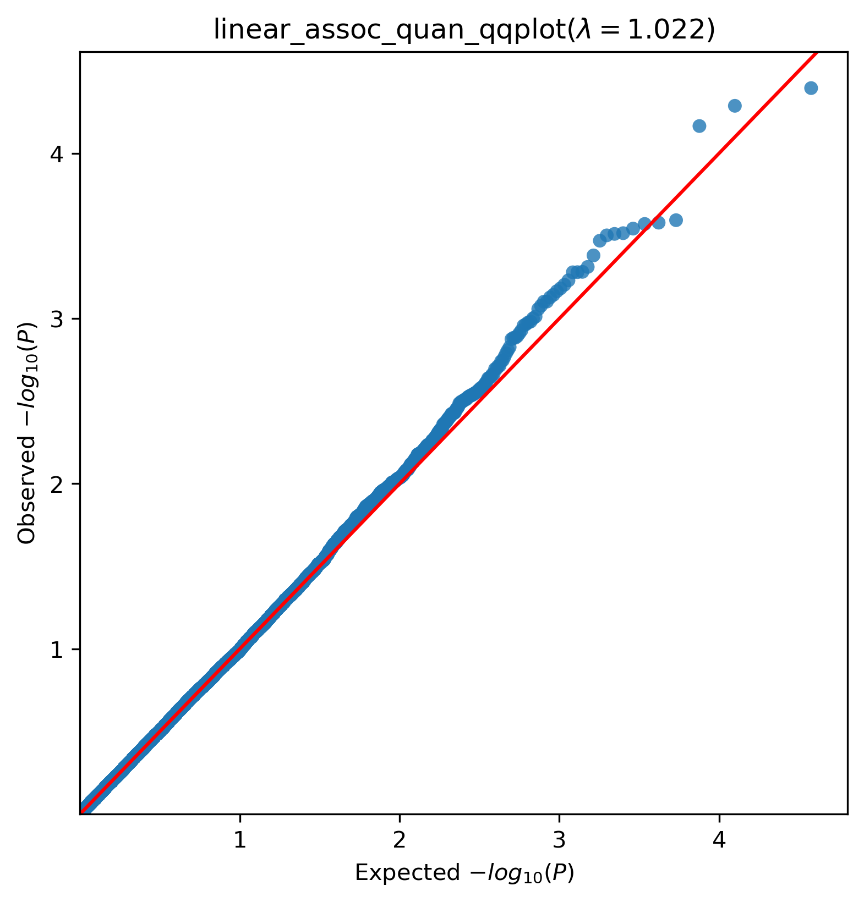

.. _use-example:
Example use case
##################
The toy dataset is not real data. It contains real SNPs and gene info, but no real individuals
It was created for testing and evaluating the pipeline only.
In this example use case, we use the toy dataset to generate gene-based scores, association analysis and machine learning models.

Annotations and PLINK files
****************************
(`Click here <https://uni-bonn.sciebo.de/s/Ih1Hhrf5ek8u8sa>`_ to download)

Annotations file
==================
(filename: toy_vcf_data.tsv)

The annotated file contains information about the SNPS, gene, deleteriousness score and allele frequency. It should also contain samples genotypes. This information is important for the calculation of the gene-based scores.

Plink binary files
===================
(filenames: toy_data.bed, toy_data.bim, toy_data.fam)

The binary files contains all genotype information for the cohort.

Gene-based scores
*****************
The gene-based scores can be found `here <https://github.com/AldisiRana/GenRisk/blob/master/toy_example/toy_genes_scores.tsv>`_.
These scores are used as input for the association analysis and as features for the machine learning models.

Association analysis
********************
We performed linear regression on the qunatitative phenotype and a logistic regression on the binary phenotype. Results can be found `here <https://github.com/AldisiRana/GenRisk/blob/master/toy_example>`_.

The QQ-plot of quantitative phenotype:

Manhatten plot of quantitative phenotype:

Machine learning models
***********************

We have created two types of models, regression and classification. Both models use the gene-based scores as features along with covariates.
For the regression model, a quantitative trait was generated, while a binary trait was generated for the classification model.
For each model, 10 fold cross validation was done on training dataset and an extra evaluation step was done on the testing set.
The input for the model generation can be found `here <https://github.com/AldisiRana/GenRisk/blob/master/toy_example/toy_dataset_feats.tsv>`_.

Classification model
=====================

Results of model training
++++++++++++++++++++++++++

Feature importance:

.. image:: https://github.com/AldisiRana/GenRisk/blob/master/toy_example/binary_classifier_model/feature.png
    :width: 400
    :align: center

Precision-recall curve:

.. image:: https://github.com/AldisiRana/GenRisk/blob/master/toy_example/binary_classifier_model/Precision%20Recall.png
    :width: 400
    :align: center

Confusion matrix:

.. image:: https://github.com/AldisiRana/GenRisk/blob/master/toy_example/binary_classifier_model/binary_classifier_model_classifier_confusion_matrix.png
    :width: 400
    :align: center

Regression model
==================

Results for model training
+++++++++++++++++++++++++++

Feature importance:

.. image:: https://github.com/AldisiRana/GenRisk/blob/master/toy_example/quan_regression_model/feature.png
    :width: 400
    :align: center

Prediction error:

.. image:: https://github.com/AldisiRana/GenRisk/blob/master/toy_example/quan_regression_model/Prediction%20Error.png
    :width: 400
    :align: center

Residuals:

.. image:: https://github.com/AldisiRana/GenRisk/blob/master/toy_example/quan_regression_model/Residuals.png
    :width: 400
    :align: center
